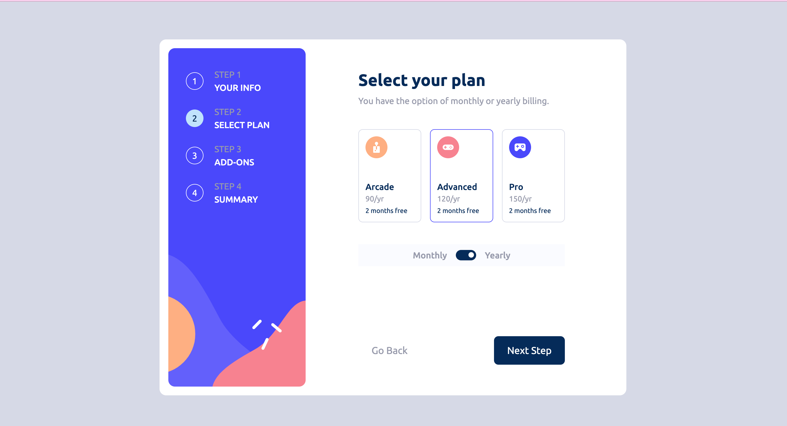

# React Multi-step form

This my solution to the [Multi-step form challenge on Frontend Mentor](https://www.frontendmentor.io/challenges/multistep-form-YVAnSdqQBJ). Frontend Mentor challenges help you improve your coding skills by building realistic projects. 

## Table of contents

- [Overview](#overview)
  - [Screenshot](#screenshot)
  - [The challenge](#the-challenge)
  - [Run the app](#run-app)
  - [Links](#links)
- [My process](#my-process)
  - [Built with](#built-with)
  - [What I learned](#what-i-learned)
- [Author](#author)

## Overview

### Screenshot




### The challenge

Users should be able to:

- Complete each step of the sequence
- Go back to a previous step to update their selections
- See a summary of their selections on the final step and confirm their order
- View the optimal layout for the interface depending on their device's screen size
- See hover and focus states for all interactive elements on the page
- Receive form validation messages if:
  - A field has been missed
  - The email address is not formatted correctly
  - A step is submitted, but no selection has been made

### Run the app

To setup the app

- Clone the repository
- Make sure you have node && npm installed. To check that, run
  ```
  node -v; npm -v;
  ```
  You shouldn't get any errors. If any, search online or ask via an issue
- After cloning the app, enter the base directory in your terminal and run this
  to install the required packages
  ```
  npm install
  ```
- To get the app started, Run
  ```
  npm run dev
  ```
- To make changes to the css (input.css), run the command below to get your app
  updated
  ```
  npm run build-css:dev
  ```

### Links

- Solution URL: [https://github.com/techemmy/React-MultiStep-Form](https://github.com/techemmy/React-MultiStep-Form)
- Live Site URL: [https://reactmultistepform-techemmys-projects.vercel.app/](https://reactmultistepform-techemmys-projects.vercel.app/)

## My process

### Built with

- Semantic HTML5 markup
- CSS custom properties
- Mobile-first workflow
- [React](https://react.dev/) - JS Frontend library
- [TailwindCSS](https://tailwindcss.com/) - A utility-first CSS framework

### What I learned

- Manual form validation
- Practiced using Reducers

## Author

- Frontend Mentor - [@techemmy](https://www.frontendmentor.io/profile/techemmy)

